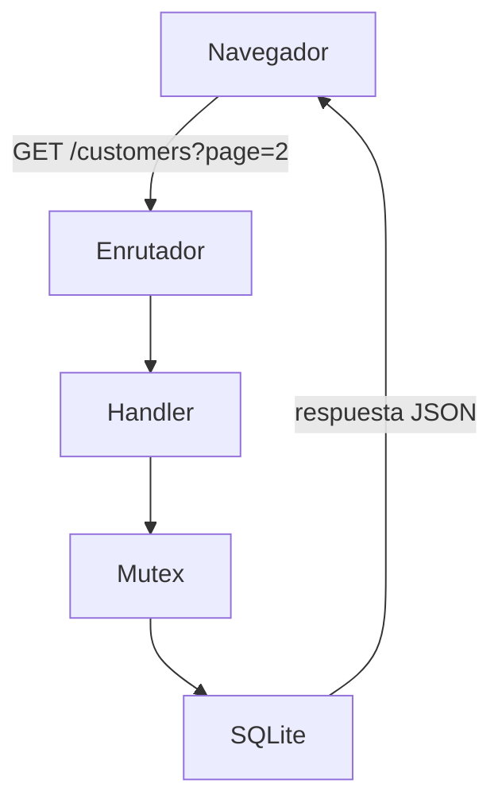

# Northwind · Customer Management

Aplicación full-stack de gestión de clientes sobre la base de datos Northwind: API REST en Rust con Rocket y panel administrativo en Next.js.


---

## 🔗 Demo en vivo

| | |
| --- | --- |
| **Aplicación** | **https://northwind-fullstack.vercel.app/** |
| **API** | **https://northwind-api-hkvs.onrender.com/health** |

> **La primera carga puede tardar hasta un minuto.** La API está en el plan gratuito de
> Render, que suspende la instancia tras 15 minutos sin tráfico y tiene que arrancarla de
> nuevo con la siguiente petición. El panel lo da por hecho: reintenta hasta 90 segundos
> con backoff y, si a los 3 segundos aún no hay datos, muestra un aviso explicando que el
> servidor está despertando. Después de la primera respuesta, todo va inmediato.

<!-- TODO(vídeo): pegar aquí el botón a la demo en YouTube cuando esté grabada.
     Plantilla lista para rellenar — solo hay que sustituir VIDEO_ID:

     [](https://www.youtube.com/watch?v=VIDEO_ID)
-->

---

## Contenido

- [Stack](#stack)
- [Arranque local](#arranque-local)
- [La API](#la-api)
- [Arquitectura](#arquitectura)
- [Decisiones técnicas](#decisiones-técnicas)
- [Tests](#tests)
- [Despliegue](#despliegue)
- [Limitaciones conocidas](#limitaciones-conocidas)

---

## Stack

| Capa | Tecnología | Versión | Por qué |
| --- | --- | --- | --- |
| **Backend** | Rust · edition 2021 | toolchain 1.98 | La edition está fijada a 2021 a propósito (ver `back/Cargo.toml`) |
| | Rocket | 0.5.1 | Primera versión estable async, sobre Tokio |
| | rusqlite | 0.40 · feature `bundled` | SQLite se compila desde su código C y se enlaza estáticamente |
| | serde / serde_json | 1.0 | Serialización JSON |
| **Base de datos** | SQLite | 3.53.2 (embebida) | 93 clientes, 16 282 pedidos |
| **Frontend** | Next.js · App Router | 15.5.25 | |
| | React | 19.1.0 | |
| | TypeScript | 5 · modo estricto | |
| | Tailwind CSS | 4 | |
| | shadcn/ui sobre Radix | dialog 1.1 · select 2.3 | Componentes copiados al proyecto, no una dependencia |
| **Gestor de paquetes** | pnpm | 11 | |
| **Despliegue** | Render + Vercel | | Ver [Despliegue](#despliegue) |

---

## Arranque local

**Requisitos:** Rust y Cargo (1.98 o superior), Node.js 20+, pnpm.

### Backend

> [!IMPORTANT]
> **`northwind.db` NO está en el repositorio.** Pesa 24 MB y está en `.gitignore`, así
> que hay que descargarla antes del primer arranque. Sin este paso el servidor **no
> arranca**: aborta el lanzamiento con un diagnóstico que indica la ruta que intentó
> abrir y el directorio de trabajo desde el que la resolvió.

```bash
cd back

# 1. Descargar la base de datos (24 MB) EN LA RAÍZ DEL BACKEND.
#    La ruta importa: main.rs abre "northwind.db" relativo al directorio de trabajo.
curl -L -o northwind.db \
  https://github.com/jpwhite3/northwind-SQLite3/raw/main/dist/northwind.db

# 2. Comprobar que llegó entera: 93 clientes.
sqlite3 northwind.db "SELECT COUNT(*) FROM Customers;"   # → 93

# 3. Arrancar. La primera compilación tarda unos minutos porque
#    rusqlite compila SQLite desde su código C.
cargo run                                                 # → http://localhost:8001
```

Comprobación rápida de que todo está en pie:

```bash
curl localhost:8001/health
# {"customers":93,"sqlite":"3.53.2","status":"ok"}
```

| Variable | Por defecto | Para qué |
| --- | --- | --- |
| `CORS_ALLOWED_ORIGIN` | `http://localhost:3000` | Origen que el navegador puede usar contra la API |

En local no hace falta definir nada: el valor por defecto ya es el del frontend en desarrollo.

### Frontend

El backend tiene que estar corriendo: el panel no tiene datos propios ni fixtures.

```bash
cd front
pnpm install
pnpm dev                                                  # → http://localhost:3000
```

| Variable | Por defecto | Para qué |
| --- | --- | --- |
| `NEXT_PUBLIC_API_URL` | `http://localhost:8001` | URL base de la API |

Tampoco hace falta crear ningún `.env` en local. Si la API está en otro sitio,
`cp .env.example .env.local` y editar el valor.

📖 **El detalle del frontend —estructura, comandos, y el razonamiento completo de sus
decisiones— está en [`front/README.md`](front/README.md).**

---

## La API

Seis endpoints. Todos los ejemplos de abajo se ejecutaron contra
`https://northwind-api-hkvs.onrender.com` y las respuestas son las reales; el JSON de las más
largas está formateado para poder leerlo.

**Todos los errores comparten la misma forma**, vengan del handler o de un catcher:

```json
{ "error": "codigo_corto", "message": "explicación legible" }
```

Un solo formato significa que el frontend escribe **una** función para manejar errores, no dos.

### `GET /health`

```bash
curl https://northwind-api-hkvs.onrender.com/health
```
```json
{"customers":93,"sqlite":"3.53.2","status":"ok"}
```

Responder esto exige que funcione la cadena completa —estado gestionado, mutex, SQLite y
una consulta real—, así que es lo primero que conviene mirar cuando algo falla.

### `GET /customers` — listado paginado, filtrado y ordenado

```bash
curl 'https://northwind-api-hkvs.onrender.com/customers?page=1&pageSize=2&sortBy=customerId&sortDir=asc'
```
```json
{
  "data": [
    { "customerId": "ALFKI", "companyName": "Alfreds Futterkiste",
      "contactName": "Maria Anders", "contactTitle": "Sales Representative",
      "address": "Obere Str. 57", "city": "Berlin", "region": "Western Europe",
      "postalCode": "12209", "country": "Germany",
      "phone": "030-0074321", "fax": "030-0076545" },
    { "customerId": "ANATR", "companyName": "Ana Trujillo Emparedados y helados",
      "contactName": "Ana Trujillo", "contactTitle": "Owner",
      "address": "Avda. de la Constitución 2222", "city": "México D.F.",
      "region": "Central America", "postalCode": "05021", "country": "Mexico",
      "phone": "(5) 555-4729", "fax": "(5) 555-3745" }
  ],
  "total": 93, "page": 1, "pageSize": 2
}
```

| Parámetro | Por defecto | Notas |
| --- | --- | --- |
| `page` | `1` | Base 1 |
| `pageSize` | `10` | Se recorta al rango 1–100 |
| `companyName` | — | Coincidencia parcial, `LIKE %texto%` |
| `sortBy` | `companyName` | `customerId`, `companyName`, `contactName`, `contactTitle`, `city`, `country` |
| `sortDir` | `asc` | `asc` o `desc` |

El filtro es parcial y no distingue mayúsculas, así que busca dentro del nombre:

```bash
curl 'https://northwind-api-hkvs.onrender.com/customers?companyName=ana&pageSize=3'
```
```
total: 2  →  ANATR (Ana Trujillo Emparedados y helados)  ·  HANAR (Hanari Carnes)
```

`Hanari` aparece porque contiene `ana`. Un `sortBy` que no esté en la lista **no da
error**: cae en el orden por defecto en silencio, algo que se explica en
[Whitelist en el ORDER BY](#whitelist-en-el-order-by).

### `GET /customers/<id>`

```bash
curl https://northwind-api-hkvs.onrender.com/customers/ALFKI
```
```json
{"customerId":"ALFKI","companyName":"Alfreds Futterkiste","contactName":"Maria Anders",
 "contactTitle":"Sales Representative","address":"Obere Str. 57","city":"Berlin",
 "region":"Western Europe","postalCode":"12209","country":"Germany",
 "phone":"030-0074321","fax":"030-0076545"}
```

El identificador se normaliza a mayúsculas, así que `/customers/alfki` es el mismo
recurso. Los dos caminos de error:

```bash
curl -i https://northwind-api-hkvs.onrender.com/customers/ZZZZZ     # HTTP 404
{"error":"not_found","message":"no customer with id 'ZZZZZ'"}

curl -i https://northwind-api-hkvs.onrender.com/customers/AB        # HTTP 400
{"error":"invalid_customer_id",
 "message":"customerId must be exactly 5 alphanumeric ASCII characters (e.g. \"ALFKI\")"}
```

### `POST /customers`

Los once campos. `customerId` y `companyName` son obligatorios; el resto acepta `null`.

```bash
curl -i -X POST https://northwind-api-hkvs.onrender.com/customers \
  -H 'Content-Type: application/json' \
  -d '{"customerId":"TEST1","companyName":"Pruebas SL","contactName":"Ada Lovelace",
       "contactTitle":"CTO","address":"Calle Mayor 1","city":"Madrid","region":null,
       "postalCode":"28013","country":"Spain","phone":"+34 900 000 000","fax":null}'
```
```
HTTP/1.1 201 Created
location: /customers/TEST1

{"customerId":"TEST1","companyName":"Pruebas SL","contactName":"Ada Lovelace",
 "contactTitle":"CTO","address":"Calle Mayor 1","city":"Madrid","region":null,
 "postalCode":"28013","country":"Spain","phone":"+34 900 000 000","fax":null}
```

Repetir la misma llamada:

```
HTTP/1.1 409 Conflict
{"error":"duplicate_id","message":"a customer with id 'TEST1' already exists"}
```

La cabecera `Content-Type: application/json` no es opcional: sin ella la ruta ni siquiera
se selecciona y la respuesta es un 404 desconcertante.

### `PUT /customers/<id>`

> [!WARNING]
> **Es un reemplazo total.** Escribe las diez columnas editables con lo que reciba, y un
> campo ausente del cuerpo **no se conserva: se guarda como `NULL`**. Enviar solo
> `{"companyName":"…","city":"Barcelona"}` cambiaría la ciudad y vaciaría los otros ocho
> campos, sin error y sin que nadie se entere hasta que falte un teléfono.

```bash
curl -X PUT https://northwind-api-hkvs.onrender.com/customers/TEST1 \
  -H 'Content-Type: application/json' \
  -d '{"companyName":"Pruebas SL","contactName":"Ada Lovelace","contactTitle":"CTO",
       "address":"Calle Mayor 1","city":"Barcelona","region":null,"postalCode":"28013",
       "country":"Spain","phone":"+34 900 000 000","fax":null}'
```
```
HTTP/1.1 200 OK
{"customerId":"TEST1","companyName":"Pruebas SL","contactName":"Ada Lovelace",
 "contactTitle":"CTO","address":"Calle Mayor 1","city":"Barcelona","region":null,
 "postalCode":"28013","country":"Spain","phone":"+34 900 000 000","fax":null}
```

El `customerId` va en la URL, no en el cuerpo: no se puede cambiar.

### `DELETE /customers/<id>`

```bash
curl -i -X DELETE https://northwind-api-hkvs.onrender.com/customers/TEST1
```
```
HTTP/1.1 204 No Content
```

Y el caso que en esta base de datos es el **normal**:

```bash
curl -i -X DELETE https://northwind-api-hkvs.onrender.com/customers/ALFKI
```
```
HTTP/1.1 409 Conflict
{"error":"has_orders",
 "message":"customer 'ALFKI' cannot be deleted because it has associated orders
            — delete or reassign them first"}
```

Los 93 clientes de Northwind tienen pedidos —16 282 en total—, así que **borrar
cualquiera de ellos devuelve 409**. Solo se puede borrar de verdad un cliente creado
desde el panel. El porqué está en
[Claves foráneas encendidas y el 409](#claves-foráneas-encendidas-y-el-409).

### El contrato, resumido

| Método | Ruta | Éxito | Errores posibles |
| --- | --- | --- | --- |
| GET | `/health` | 200 | 503 si la base no responde |
| GET | `/customers` | 200 + `Paginated<Customer>` | 500 |
| GET | `/customers/<id>` | 200 + `Customer` | 400, 404, 500 |
| POST | `/customers` | 201 + `Location` | 400, 409, 422, 500 |
| PUT | `/customers/<id>` | 200 + `Customer` | 400, 404, 422, 500 |
| DELETE | `/customers/<id>` | 204 | 400, 404, 409 si tiene pedidos, 500 |

---

## Arquitectura



La API no es ninguna de las cajas: son las dos flechas. El navegador no sabe que dentro
hay Rust, ni Rocket, ni un mutex, ni SQLite; solo sabe que si manda
`GET /customers?page=2` recibe un JSON con `data`, `total`, `page` y `pageSize`. Se
podría reescribir todo el interior en otro lenguaje y el frontend no se enteraría.

📖 **El recorrido completo —qué hace cada pieza, dónde encajan los catchers y por qué
SQLite no es un servidor— está en
[`docs/conceptos/01-que-es-una-api.md`](docs/conceptos/01-que-es-una-api.md).**

---

## Decisiones técnicas

### `Mutex<Connection>` no es una precaución, es un requisito del compilador

Lo intuitivo es leer el `Mutex` como una medida defensiva: "por si acaso dos peticiones
chocan". No es eso. **Sin él, el programa no compila.**

Rocket atiende peticiones en varios hilos y todos comparten el mismo estado gestionado,
así que exige que ese estado sea `Send + Sync`. La `Connection` de rusqlite es `Send`
—se puede mover a otro hilo— pero **no** es `Sync`, porque no admite que varios hilos la
usen a la vez. `Mutex<Connection>` sí es `Sync`: el mutex garantiza que solo uno entre
cada vez, que es justo lo que le faltaba al tipo.

Aquí la seguridad de tipos no está avisando de un riesgo teórico, está impidiendo
compilar un programa que corrompería datos.

**Trade-off:** el mutex **serializa todos los accesos a la base**. Con 50 peticiones
simultáneas, 49 esperan en la cola. Para 93 filas y una demo es irrelevante; en
producción se sustituiría por un pool de conexiones (`r2d2_sqlite`), que reparte varias
conexiones entre los hilos en lugar de hacerlos pelear por una.

### Whitelist en el `ORDER BY`

Los parámetros de SQL (`?1`, `?2`…) solo sustituyen **valores**, nunca identificadores.
No se puede parametrizar el nombre de una columna, así que el nombre tiene que
interpolarse en el texto de la consulta — y eso es exactamente por donde entra una
inyección SQL.

Lo que hace el peligro difícil de detectar es esto: **`ORDER BY ?1` no falla**. SQLite lo
acepta sin rechistar y ordena por una constante, que vale lo mismo para todas las filas.
Resultado: cero error, cero ordenación, y una consulta que parece funcionar hasta que
alguien se fija en que el orden nunca cambia.

La solución es no dejar que el texto del usuario llegue nunca a la consulta:

```rust
fn sort_column(requested: Option<&str>) -> &'static str {
    match requested.unwrap_or_default().to_ascii_lowercase().as_str() {
        "customerid"  => "CustomerID",
        "companyname" => "CompanyName",
        // …
        _ => DEFAULT_SORT_COLUMN,
    }
}
```

La función no devuelve lo que le dieron: devuelve uno de los literales que están escritos
en el propio código. Lo que se interpola en el SQL es siempre una cadena que estaba en el
binario, con lo que la inyección deja de ser posible por construcción y no por
saneamiento.

**Trade-off:** un `sortBy` desconocido cae al valor por defecto **en silencio**, sin
error. Es deliberado —ver [Validación permisiva o estricta](#validación-permisiva-en-la-lectura-estricta-en-la-escritura)—
pero significa que un error de escritura en el parámetro da un orden que no es el que se
pidió sin decirlo. Por eso el frontend mantiene la lista de columnas ordenables como un
tipo de TypeScript y no como cadenas sueltas.

### `open_with_flags` sin la bandera de creación

```rust
let flags = OpenFlags::SQLITE_OPEN_READ_WRITE
    | OpenFlags::SQLITE_OPEN_NO_MUTEX
    | OpenFlags::SQLITE_OPEN_URI;
let conn = Connection::open_with_flags(path, flags)?;
```

Lo cómodo sería `Connection::open(path)`, pero esa función incluye
`SQLITE_OPEN_CREATE`: **si el archivo no existe, lo crea vacío**. Un error de tipeo en la
ruta, o arrancar desde el directorio equivocado, produciría entonces un servidor que
levanta perfectamente, responde 200 a todo y devuelve cero clientes. El fallo no
aparecería al arrancar sino más tarde, disfrazado de "no hay datos".

Omitiendo la bandera, un archivo que falta es un error al abrir, y el arranque se aborta
con un diagnóstico que dice la ruta configurada, el directorio de trabajo y la ruta
absoluta a la que se resolvió. Un fallo ruidoso y temprano en lugar de uno silencioso y
tardío.

`SQLITE_OPEN_NO_MUTEX` completa la idea: le indica a SQLite que no ponga su propio
bloqueo interno, porque la exclusión ya la garantiza el `Mutex` de Rust. Dos candados
para la misma puerta serían un coste sin ninguna seguridad adicional.

### Claves foráneas encendidas, y el 409

SQLite trae las claves foráneas **desactivadas** por defecto, por compatibilidad
histórica, y el ajuste es **por conexión**: no basta con que el esquema declare la
relación.

```rust
conn.execute("PRAGMA foreign_keys = ON", [])?;
```

Sin esa línea, borrar un cliente con pedidos **funciona**: devuelve 204 y deja los
pedidos apuntando a un cliente que ya no existe. La corrupción es silenciosa y solo se
descubre mucho después, cuando algún informe cruza las dos tablas.

Con la línea, SQLite rechaza el borrado con una violación de restricción, que el handler
traduce a un 409 con el código `has_orders`. Y como los 93 clientes tienen pedidos, **ese
409 es el camino normal, no la excepción**: es lo que va a pasar casi siempre.

El frontend está construido en consecuencia — el diálogo no se cierra, el aviso es
informativo en azul en lugar de un error en rojo, y el botón pasa a "Entendido" en vez de
ofrecer un reintento cuyo resultado sería idéntico. Pintar de rojo el resultado más
frecuente de una operación entrena a la persona usuaria a ignorar el rojo, que es justo
lo que no conviene el día que algo se rompa de verdad.

### Validación permisiva en la lectura, estricta en la escritura

Las dos mitades de la API validan con criterios opuestos, a propósito.

**En `GET /customers` nada da error.** Un `pageSize=5000` se recorta a 100; un
`sortBy=inventado` cae al orden por defecto; un `page` negativo pasa a 1. Un listado es
**presentación**: un enlace guardado hace meses, o una URL con un parámetro que ya no
existe, deben seguir mostrando algo útil. Un muro de errores por un parámetro decorativo
es peor servicio que enseñar la primera página.

**En `POST` y `PUT` la validación es estricta.** Un `customerId` que no sean cinco
caracteres alfanuméricos es un 400; un `companyName` vacío o solo con espacios es un 400.
Escribir es **persistencia**: el radio de daño es permanente y afecta a todo el que lea
después. Aquí es mejor rechazar y explicar que aceptar y guardar basura.

La regla, en una frase: **ser tolerante con lo que se muestra, intransigente con lo que
se guarda.**

### Fairing de CORS propio en vez de `rocket_cors`

CORS aquí necesita exactamente tres cosas: un origen configurable, una lista fija de
métodos y una cabecera permitida. Eso son unas cuarenta líneas de fairing que se leen de
una sentada y dicen con precisión qué permite el servidor.

`rocket_cors` resuelve el estándar completo —listas de orígenes, credenciales, cabeceras
expuestas, `Vary`— y arrastra su propio calendario de versiones, que en la transición a
Rocket 0.5 fue una fuente conocida de fricción. Para esta superficie, la dependencia
costaba más de lo que ahorraba.

**Trade-off:** el fairing propio **no implementa el estándar entero**. Permite un único
origen, no emite `Vary: Origin` y no soporta credenciales. Si mañana hicieran falta
varios frontends con dominios distintos, o cookies entre orígenes, la decisión correcta
sería pasar a un crate que ya lo tenga resuelto en vez de ir parcheando el propio.

### Catchers que responden JSON

El ciclo de vida de una petición en Rocket es
`routing → request guards → data guard → handler → responder`, y **un fallo puede ocurrir
antes de llegar al handler**:

| Fallo | Dónde ocurre | Ejemplo |
| --- | --- | --- |
| Ninguna ruta casa | routing | `GET /rutaquenoexiste` → 404 |
| El cuerpo no es JSON válido | data guard | Una coma de más → 400 |
| Es JSON, pero falta un campo | data guard | Sin `companyName` → 422 |

En esos casos el código del handler **nunca se ejecuta**, así que no existe ningún punto
del programa donde construir la respuesta de error a mano. Rocket respondería con su
página HTML por defecto, y un frontend que hace `response.json()` se rompería con un
`unexpected token <` — un error que no dice nada de lo que pasó realmente.

Los catchers cubren ese hueco: convierten un `Status` suelto en el mismo `{error,
message}` que emite el resto de la API. La regla en una frase: **`ApiError` protege la
salida del código propio; los catchers protegen todo lo que lo rodea.**

Un detalle confirma que están bien montados: un error del handler como
`invalid_customer_id` **no** se convierte en el genérico `malformed_json`. Los catchers
solo saltan cuando Rocket tiene un `Status` desnudo, y un `ApiError` ya es una respuesta
completa —código, `Content-Type` y cuerpo— que sale tal cual.

### `fetch` en vez de axios, shadcn/ui en vez de Material-UI

El [ENUNCIADO](ENUNCIADO.md) pedía axios y Material-UI. El frontend usa `fetch` y
shadcn/ui. Las dos divergencias son deliberadas:

- **`fetch` sobre axios.** Lo que el buscador necesita de verdad es `AbortController`,
  para cancelar la petición anterior en cada pulsación y evitar que las respuestas
  lleguen desordenadas. `fetch` lo acepta directamente; axios lo envuelve. Además axios
  convierte todo status ≥ 400 en una excepción con la respuesta enterrada en
  `error.response`, lo que estorba justo en la distinción que aquí importa: un
  `TypeError` sin status —backend caído o CORS ausente— frente a un 409 con cuerpo.
  **Cuándo sería mejor axios:** con interceptores, reintentos automáticos o
  autenticación con refresco de token, es decir, en cuanto la capa de red deje de ser
  trivial.

- **shadcn/ui sobre Material-UI.** Los componentes se copian al proyecto y se versionan
  como cualquier otro archivo, en vez de ajustarse a través de un sistema de theming
  ajeno. Y Material Design trae una opinión visual —elevaciones, ondas al pulsar, color
  de marca por todas partes— que choca con la de este panel, donde el color está
  reservado para señal: rojo es "algo falló", azul es "regla de negocio", y todo lo demás
  es gris para que esos dos se vean. **Cuándo sería mejor MUI:** en un equipo que ya
  tenga un design system encima de MUI, donde la consistencia con lo existente vale más
  que cualquiera de estos argumentos.

📖 El razonamiento completo de ambas, con el detalle de accesibilidad y de tamaño de
bundle, está en [`front/README.md`](front/README.md#decisiones-técnicas).

---

## Tests

```bash
cd back && cargo test
```

```
running 11 tests
test result: ok. 11 passed; 0 failed; 0 ignored
```

Los tests levantan una instancia real de Rocket con el cliente de pruebas del framework y
consultan la base de datos de verdad, así que ejercitan la cadena completa: enrutado,
guards, handler, mutex, SQLite y serialización.

**Qué cubren:**

| Test | Qué comprueba |
| --- | --- |
| `health_reports_the_93_customers` | La cadena entera responde y cuenta 93 clientes |
| `list_defaults_to_ten_per_page` | Los valores por defecto de la paginación |
| `page_size_is_honoured` | `pageSize` cambia el tamaño de la página |
| `page_size_is_capped` | `pageSize` se recorta a 100 |
| `company_name_filters_case_insensitively` | El filtro parcial sin distinguir mayúsculas |
| `unknown_sort_by_falls_back_to_the_default` | La whitelist del `ORDER BY` no rompe |
| `get_by_id_returns_the_customer` | Lectura por identificador |
| `get_by_id_normalises_the_case` | `/customers/alfki` y `/customers/ALFKI` son el mismo recurso |
| `unknown_id_returns_a_json_404` | El 404 sale como JSON, no como HTML |
| `unknown_route_is_caught_as_json` | El catcher de ruta inexistente también responde JSON |
| `responses_carry_the_cors_header` | El fairing de CORS añade su cabecera |

**Qué NO cubren:** son **solo de lectura**. No hay ni un test de `POST`, `PUT` o
`DELETE`, y es una decisión consciente: se ejecutan contra el `northwind.db` real, así que
un test de escritura modificaría el archivo de trabajo y los siguientes dejarían de ser
reproducibles —el primer `cargo test` pasaría y el segundo fallaría por un id duplicado—.

Probarlas bien exige aislar el estado: copiar la base a un archivo temporal por test, o
abrirla en memoria y cargar el esquema. Ninguna de las dos está hecha, así que **las
validaciones de escritura, el 409 de duplicado y el 409 de pedidos están verificados a
mano** (las llamadas de [La API](#la-api) son precisamente esas comprobaciones) **pero no
en la suite automática.** Es la brecha más grande de este repositorio.

---

## Despliegue

### Backend en Render

Un servicio Docker construido desde GitHub. La configuración entera son seis campos:

| Campo | Valor |
| --- | --- |
| Región | Virginia |
| Plan | Free |
| Runtime | Docker |
| Build Context | `back` |
| Dockerfile Path | `back/Dockerfile` |
| Health Check Path | `/health` |

El contexto es `back` y no la raíz porque el `Dockerfile` copia `Cargo.toml`, `Cargo.lock`
y `src/` con rutas relativas al backend; con la raíz como contexto el build subiría también
`front/` y no encontraría nada donde lo busca.

*(El primer destino fue Fly.io. Se descartó cuando su trial —7 días o 2 horas de máquina—
expiró: detrás no hay plan gratuito.)*

**Por qué no Vercel también para el backend.** Vercel ejecuta funciones serverless: el
filesystem es de solo lectura salvo `/tmp`, y además efímero entre invocaciones. SQLite no
es un servidor al que conectarse, **es un archivo que el proceso abre y escribe**, así que
un backend con SQLite embebido necesita un proceso de larga vida con disco propio. Render
da justo eso —un contenedor que corre— y por eso el reparto es Vercel para el frontend y
Render para la API.

#### La imagen

`back/Dockerfile` es multi-stage: compila con la imagen oficial de Rust y despacha sobre
`debian:bookworm-slim`. **Imagen final: 158 MB** — 85 MB de base Debian, 25 MB de base de
datos y 6 MB de binario ya pasado por `strip`.

Cuatro detalles que hacen que funcione:

- **La caché de capas está montada al revés a propósito.** Se copian primero `Cargo.toml`
  y `Cargo.lock` y se compilan las dependencias con un `main.rs` falso; solo después
  entra `src/`. Así un cambio de código no vuelve a compilar el árbol entero —que incluye
  compilar SQLite desde C, la parte lenta con diferencia—. Medido: 4 min 22 s en frío,
  **19 s** tras tocar un archivo fuente.

- **No se instala ninguna librería de SQLite en la imagen final**, porque `bundled` la
  enlaza estáticamente dentro del binario. Verificado con `ldd`: el binario solo pide
  `libgcc_s`, `libm`, `libc` y el cargador.

- **`northwind.db` se descarga durante el build, con el sha256 fijado.** El archivo pesa
  24 MB y está en `.gitignore`, así que un `COPY` exigiría tenerlo en el disco de quien
  construye — y quien construye aquí es una plataforma que parte de un clon limpio del
  repositorio. Descargándolo en el `Dockerfile` la imagen se construye desde el repo y
  nada más. El `--checksum` no es decorativo: sin él, el despliegue ejecutaría el archivo
  que hoy haya en una rama de un tercero; con el hash fijado, si el archivo remoto cambia
  el build **falla en esa línea** en lugar de servir una base distinta a la probada, y
  actualizar la base pasa a ser un cambio explícito y revisable en el diff.

- **`ROCKET_ADDRESS=0.0.0.0` es la línea que hace el contenedor alcanzable.** Rocket
  escucha en `127.0.0.1` por defecto, que dentro de un contenedor es el loopback *del
  contenedor*: el servidor arranca, anuncia tan tranquilo que se lanzó, responde a un
  curl hecho desde dentro y **rechaza toda conexión que venga de fuera**. Lo cruel del
  síntoma es que **no hay ningún error en los logs** —desde el punto de vista de Rocket
  todo va bien—; desde fuera solo se ve `connection refused`, y en la plataforma, health
  checks que fallan sin explicación. `0.0.0.0` significa "escucha en todas las
  interfaces", que es lo que necesitan el reenvío de puertos de Docker y el proxy de
  Render.

#### El puerto se lee de `PORT`

Render no sabe qué framework hay dentro del contenedor: asigna un puerto y lo comunica por
la variable `PORT`, la convención común. Un servicio que la ignore y escuche en un puerto
fijo no recibe tráfico, porque la plataforma enruta hacia el puerto que eligió ella.

Lo que obliga a leerla **explícitamente** es Figment, la capa de configuración de Rocket:
`main.rs` fija el puerto con `Config::figment().merge(("port", …))`, y en Figment un
`merge` tiene más precedencia que las variables de entorno. Es decir, `ROCKET_PORT` —la
vía normal de Rocket— **no movería nada**: el merge la pisaría. Por eso `main.rs` lee
`PORT` del entorno *antes* del merge y lo mete ahí, cayendo en 8001 si nadie dice nada.
Así `cargo run` sigue funcionando sin exportar ninguna variable y Render puede inyectar
el suyo sin reconstruir la imagen.

#### `CORS_ALLOWED_ORIGIN`

Se deja **fuera** de la imagen a propósito y se define en Render como variable de entorno
del servicio, con el valor `https://northwind-fullstack.vercel.app`. Con un valor por
defecto dentro de la imagen, cambiar el origen permitido —al mover el frontend de dominio—
obligaría a reconstruir y redesplegar la imagen entera para cambiar una cadena de texto.
Sin definirla, `cors.rs` cae en `http://localhost:3000`, que es justo lo que hace falta en
desarrollo.

#### Filesystem efímero y arranque en frío

Las dos consecuencias del plan Free, las dos asumidas:

- **La base de datos viaja dentro de la imagen, sin volumen persistente.** Lo que se
  escriba se pierde en el siguiente reinicio o redespliegue, y para una demo eso es una
  ventaja: cualquiera puede crear, editar y borrar sin miedo, y la base vuelve sola a sus
  93 clientes sin ningún paso manual de limpieza. Si esto tuviera que guardar datos de
  verdad, sería el error más grave del proyecto.

- **La instancia se suspende tras 15 minutos sin tráfico** y tarda alrededor de un minuto
  en volver. El frontend lo trata como lo que es —una espera, no un error—: reintenta con
  backoff exponencial hasta 90 segundos y, si a los 3 segundos no hay datos, muestra un
  aviso de que el servidor está despertando. Solo reintenta antes de la primera respuesta;
  a partir de ahí un fallo ya es un fallo de verdad y se muestra como tal. Verificado de
  extremo a extremo contra el despliegue real.

### Frontend en Vercel

Se despliega el directorio `front/` con la configuración por defecto de Next.js. La única
variable es `NEXT_PUBLIC_API_URL`, apuntando a `https://northwind-api-hkvs.onrender.com`.
El prefijo `NEXT_PUBLIC_` es obligatorio: las peticiones salen del navegador, no del servidor de
Next, así que la variable tiene que viajar en el bundle.

---

## Limitaciones conocidas

Todas están verificadas, no son sospechas.

### El orden alfabético no respeta los acentos

Ordenando por ciudad de forma descendente, el primer resultado es **Århus**, por delante
de Warszawa:

```bash
curl 'https://northwind-api-hkvs.onrender.com/customers?sortBy=city&sortDir=desc&pageSize=6'
# Århus · Warszawa · Walla Walla · Versailles · Vancouver · Tsawassen
```

**No es un bug, es la collation `BINARY` de SQLite**, que compara por código de carácter
y no por reglas de idioma. `Å` es U+00C5 (197) y `W` es U+0057 (87), así que en orden
descendente Århus va primero, exactamente como se le pidió. Arreglarlo requiere una
collation con reconocimiento de idioma —la extensión ICU de SQLite— o guardar una columna
adicional con el nombre normalizado sobre la que ordenar.

### Un solo mutex serializa los accesos

Todas las consultas pasan por la misma conexión protegida por un `Mutex`, así que se
atienden de una en una. Con 93 filas y una demo es imperceptible; bajo carga real sería el
primer cuello de botella. La salida es un pool de conexiones (`r2d2_sqlite`).

### `ROCKET_PORT` no cambia el puerto: la variable es `PORT`

`main.rs` fija el puerto con `Config::figment().merge(("port", …))`, y en Figment un
`merge` tiene más precedencia que las variables de entorno, así que la vía normal de
Rocket no funciona. Comprobado lanzando la imagen con `ROCKET_PORT=9999`: siguió
arrancando en el 8001. La variable que sí decide el puerto es `PORT`, que `main.rs` lee
del entorno antes del merge —ver [Despliegue](#despliegue)—. `ROCKET_ADDRESS` sí funciona
por entorno, que es lo que importaba.

### Los cambios en la demo no sobreviven al reinicio

Como la base de datos va dentro de la imagen y el filesystem de Render es efímero,
cualquier cliente creado o editado en `northwind-fullstack.vercel.app` desaparece cuando
la instancia se reinicia o se redespliega, y la base vuelve a sus 93 clientes. Es
intencional —ver [Despliegue](#despliegue)— pero conviene saberlo antes de enseñar la
demo.

### La primera petición tras un rato inactiva tarda ~1 minuto

El plan gratuito de Render suspende la instancia tras 15 minutos sin tráfico. El panel lo
absorbe reintentando hasta 90 segundos y avisando a los 3, así que se ve una espera
explicada en vez de un error, pero la espera existe. Desaparece con un plan que no
suspenda.

### El buscador filtra por nombre de empresa, no por identificador

Buscar `ALFKI` no encuentra nada; hay que buscar `Alfreds`. El filtro se aplica solo sobre
`companyName`, que es lo que pide el enunciado. Ampliarlo sería añadir un `OR CustomerID
LIKE ?` en la consulta y otro parámetro en la whitelist.

### Los tests no cubren la escritura

Detallado en [Tests](#tests): las once pruebas automáticas son de lectura, y las
operaciones de escritura están verificadas a mano.

---

## Estructura del repositorio

```
.
├── back/                    API en Rust · Rocket
│   ├── src/
│   │   ├── main.rs          rutas, validación, ApiError y catchers
│   │   ├── models.rs        Customer, NewCustomer, UpdateCustomer, Paginated
│   │   ├── db.rs            apertura de SQLite y Mutex<Connection>
│   │   ├── cors.rs          fairing de CORS
│   │   └── tests.rs         11 tests de lectura
│   └── Dockerfile           build multi-stage · descarga northwind.db con sha256 fijado
├── front/                   panel en Next.js · ver front/README.md
├── docs/conceptos/          documento de conceptos sobre el flujo de una petición
└── ENUNCIADO.md             el enunciado original del proyecto
```

El código de ambos lados está comentado en español con las notas de diseño de cada
decisión; este README recoge las que afectan al proyecto entero.
