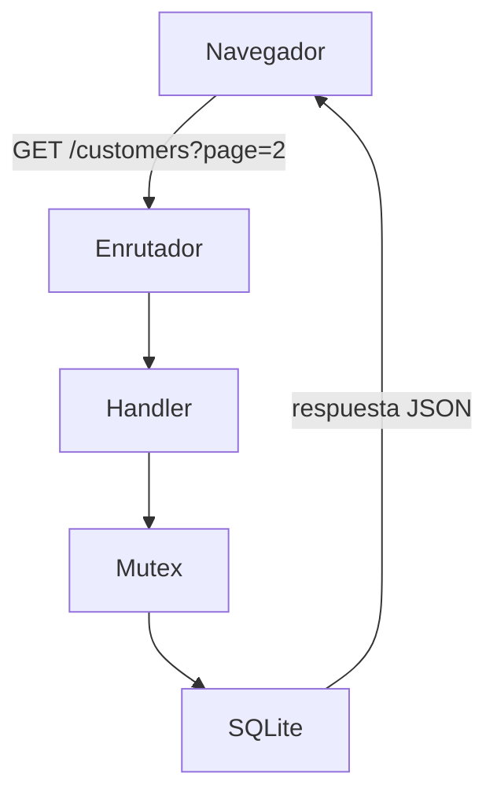

# Qué es una API y cómo fluye una petición en este proyecto

> Documento de conceptos — Proyecto 1 TELCO (Customer Management)
> Escrito durante el desarrollo, para repasar al terminar.

---

## 1. La corrección importante

La intuición común es esta:

> "La API es el intermediario: llama al backend, el backend consulta la base de datos,
> y el resultado se refleja en el frontend."

**No es exacto.** La API no es un componente que se sienta entre el frontend y el
backend. No es una caja en el diagrama.

**La API es el backend visto desde fuera.** Es el contrato: qué rutas existen, qué
parámetros aceptan, qué devuelven y con qué códigos de estado.

### La analogía del menú

El menú de un restaurante no es un camarero. No cocina nada. Es la lista de lo que
puedes pedir y cómo pedirlo.

La cocina puede cambiar por completo —nuevo chef, nuevos hornos, otra distribución—
y mientras el menú siga igual, el cliente no se entera de nada.

En este proyecto, **`back/` es la API**. Cuando se escribió `#[get("/customers")]`, se
añadió una entrada al menú.

---

## 2. El flujo completo



**Dónde está la API en este dibujo:** no es ninguna de las cajas. Son las dos flechas
—la de subida y la de bajada—. El contrato de lo que se pide y lo que se recibe.

El navegador no sabe que dentro hay Rust, ni Rocket, ni un Mutex, ni SQLite. Solo sabe
que si manda `GET /customers?page=2`, recibe un JSON con `data`, `total`, `page` y
`pageSize`. Se podría reescribir todo el interior en Python y el frontend no se
enteraría.

---

## 3. Componente por componente

| Pieza         | Archivo        | Qué hace                                                                                                |
| ------------- | -------------- | ------------------------------------------------------------------------------------------------------- |
| **Enrutador** | `main.rs`      | Recibe la petición y busca qué función la atiende. Compara método (GET/POST) y ruta. Si nada casa → 404 |
| **Handler**   | `main.rs`      | La función que hace el trabajo: valida parámetros, construye el SQL, arma la respuesta                  |
| **Mutex**     | `db.rs`        | Garantiza que solo un hilo toque la conexión a la vez                                                   |
| **SQLite**    | `northwind.db` | El archivo con los datos. Sin proceso, sin puerto, sin red                                              |

---

## 4. Tres ideas que el diagrama deja claras

### SQLite no es un servidor

No hay una caja aparte corriendo en otro puerto. Es un **archivo** que el proceso lee
directamente, usando una librería en C incrustada en el propio binario.

Con PostgreSQL habría una caja más y una conexión de red: un proceso escuchando en el
5432, al que el backend se conecta por TCP.

Y de ahí sale una consecuencia práctica: **como no hay servidor gestionando los
accesos concurrentes, esa responsabilidad recae en el propio proceso.** Por eso hace
falta el Mutex.

### El Mutex está en el camino, no al lado

Toda consulta pasa obligatoriamente por ahí. No es un componente opcional que se
consulta a veces: es un peaje por el que atraviesa el 100 % del tráfico.

Por eso **serializa** todo: con 50 peticiones simultáneas, 49 esperan en cola. Para 93
filas es irrelevante; en producción se usaría un pool de conexiones.

### El backend no sabe nada del navegador

El handler recibe una estructura de datos y devuelve otra. No sabe si al otro lado hay
un navegador, una app móvil, un `curl` desde la terminal o un script.

Esa independencia es la razón de ser de una API.

---

## 5. Dónde encajan los catchers

El ciclo de vida real de una petición en Rocket tiene más pasos que el diagrama:

```
routing → request guards → data guard → handler → responder
```

Un fallo puede ocurrir **antes** de llegar al handler:

| Fallo                        | Dónde ocurre       | Ejemplo                      |
| ---------------------------- | ------------------ | ---------------------------- |
| Ninguna ruta casa            | paso 1, routing    | `GET /rutaquenoexiste` → 404 |
| El cuerpo no es JSON válido  | paso 3, data guard | Una coma de más → 400        |
| Es JSON, pero falta un campo | paso 3, data guard | Sin `companyName` → 422      |

En esos casos **el código del handler nunca se ejecuta**. No existe ningún punto del
programa donde se pueda construir la respuesta de error a mano.

Por eso hacen falta los **catchers**: son manejadores que Rocket invoca cuando tiene un
`Status` suelto y ninguna respuesta completa.

> **La regla en una frase:** `ApiError` protege la salida del código propio; los
> catchers protegen todo lo que lo rodea.

Y un detalle que confirma que están bien montados: un error del handler (como
`invalid_customer_id`) **no** se convierte en el genérico `malformed_json`. Los catchers
solo saltan cuando Rocket tiene un `Status` desnudo; un `ApiError` ya es una respuesta
completa —código, `Content-Type` y cuerpo— y sale tal cual.

---

## 6. El contrato completo de esta API

| Método  | Ruta              | Éxito                       | Errores posibles                                                  |
| ------- | ----------------- | --------------------------- | ----------------------------------------------------------------- |
| GET     | `/health`         | 200                         | 503 si la base no responde                                        |
| GET     | `/customers`      | 200 + `Paginated<Customer>` | 500                                                               |
| GET     | `/customers/<id>` | 200 + `Customer`            | 400, 404, 500                                                     |
| POST    | `/customers`      | 201 + `Location`            | 400, 409, 422, 500                                                |
| PUT     | `/customers/<id>` | 200 + `Customer`            | 400, 404, 422, 500                                                |
| DELETE  | `/customers/<id>` | 204                         | 400, 404, 409 si tiene pedidos, 500                               |
| OPTIONS | `/<_..>`          | 204                         | — la dispara el preflight del navegador, no el código del cliente |

**Todos los errores comparten la misma forma**, venga del handler o de un catcher:

```json
{ "error": "codigo_corto", "message": "explicación legible" }
```

Un solo formato significa que el frontend escribe **una** función para manejar errores,
no dos.
